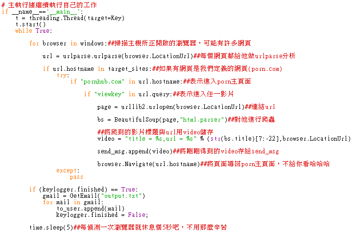
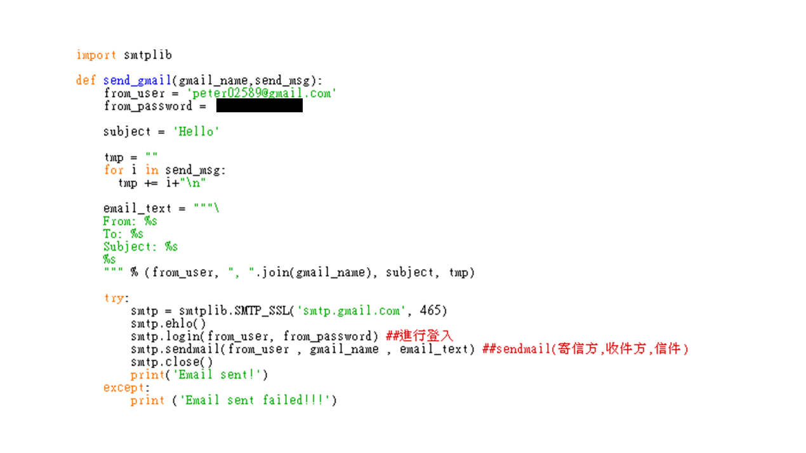
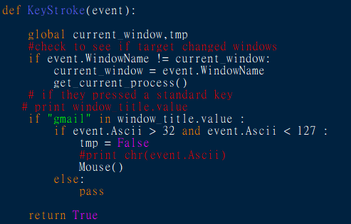
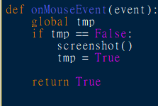
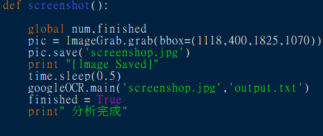
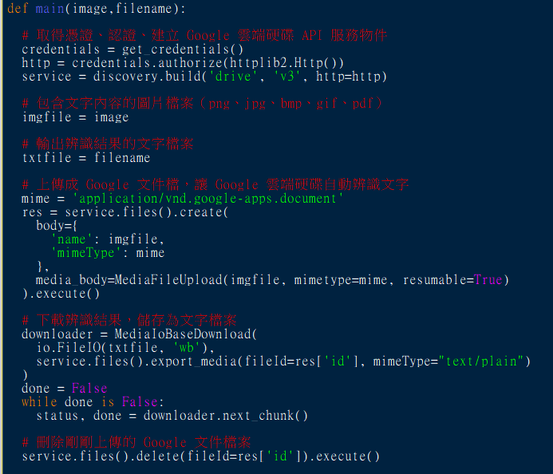

# 攔截情色&誘捕威脅
全天下的人類都會有慾望，錢慾、性慾等等，其中性慾是每個人或多或少都需要的，此時，色情網站扮演著大多數人發洩的管道，就算是有性伴侶或沒性伴侶，都會有必須自己發洩的時候，此時的人類，為了達成眼前的目的，若是一兩部影片突然不能看，他們會不疑有他地繼續點其它部影片，無形之中造成觀看影片的資料外流，我們透過這種人類的心理作用，結合電子郵件的傳遞，給予人類警告與威脅。

我們利用受害者瀏覽色情網站的行為，去蒐集他所點擊的影片標題與網址，再透過他平常使用gmail寄信的行為，我們去蒐集他的寄信者作為威脅的籌碼，將他所觀看的影片資訊寄給他的gmail寄信的好友們，作為警告與威脅。
## 架構

## 程式碼解說
開發環境  : windows 10

程式語言  : Python 2.7.15

函式庫    : urllib2、pyHook、win32api、PIL、google-api-python-client、BeautifunSoup、threading、smtplib

設定用於存放寄信內容的list、存放影片資訊的string、存放寄信者的list、以及
選擇要偵測哪些網站的directory、IE的clsid。

此為主程式，透過while True不斷偵測開啟的網站，若偵測到是porn.com，則偵測是否點擊影片，若有則對該影片連結利用爬蟲爬取影片的標題，將之存入send_msg，並將browser導回porn主頁面。

此為透過gmail寄信的function，首先要設定寄件者的帳號密碼，由於個資問題
，所以將密碼覆蓋住，接著要將整封信件，包含寄件者、收件者、標題、內容放在一個string裡，透過smtp的函式將之寄出，其中需要注意的是，寄件者的帳號必須去google帳號頁面將低安全性應用程式存取權開啟，才得以讓python去發送寄信。

此為鍵盤側錄之主要程式碼，判斷視窗名是否含有”gmail”字串來達到區隔其
他網頁的效用，接著判斷是否有鍵盤輸入再來進行滑鼠事件偵測。

此為滑鼠事件偵測之主要程式碼，利用tmp布林變數判斷是否有先進行鍵盤輸入，再進行螢幕截圖的動作。

此為螢幕截圖主要程式碼，利用pil函式庫進行區塊螢幕截圖，並給予緩衝
時間0.5秒來儲存圖片，儲存為圖片後交給googleOCR進行影像辨識。

此為GoogleOCR辨識主要程式碼，將截好的圖片進行上傳，分析完後存成文字檔。

此為正規表示法之程式碼，用上述取得之文字檔來分析EMAIL字串。

